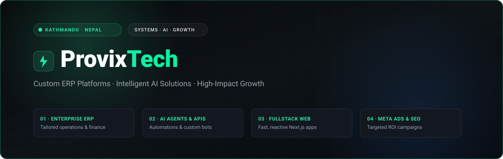
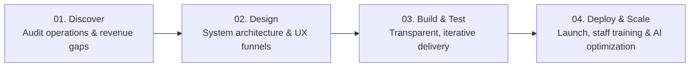

  

  <b>A technology & growth engineering studio based in Kathmandu, Nepal.</b> 
  We build custom ERP platforms, deploy intelligent AI solutions, craft modern web applications, and drive sustainable revenue through targeted Meta marketing.

---

## 💡 The ProvixTech Difference

Traditional software agencies build tools and leave you to figure out customer acquisition. Marketing agencies drive clicks without understanding your backend operations. **ProvixTech unifies both.**

| Aspect | Traditional Agency Model | The ProvixTech Way |
| :--- | :--- | :--- |
| **Team Structure** | Fragmented vendors with siloed communication | **Single unified team** for systems, AI & growth |
| **System Architecture** | Rigid off-the-shelf templates | **Custom ERPs** tailored to your actual workflow |
| **AI Integration** | Superficial add-ons or unused gimmicks | **Practical AI agents** that automate real work |
| **Market Focus** | Generic global playbooks | **Engineered for Nepal**: local payments, culture & consumer behavior |
| **Pricing & Scope** | Hidden per-seat licenses and surprise invoices | **100% transparent pricing** with clear deliverables |

---

## 🛠️ Core Capabilities

### 1. 🏢 Custom ERP & Business Systems
> *Centralized platforms built around your real-world operational workflow.*
- **Operations & Inventory**: Real-time stock alerts, multi-warehouse tracking, supplier purchase orders.
- **Sales & Billing**: Invoicing, POS integration, IRD-compatible accounting workflows.
- **Role-Based Access**: Granular permission control for staff, managers, and executives.
- **Executive Analytics**: Real-time KPI dashboards tracking revenue, burn rate, and order velocity.

### 2. 🤖 AI Services & Intelligent Automation
> *Practical AI solutions that reduce manual overhead and unlock 24/7 responsiveness.*
- **Custom AI Chatbots**: Context-aware conversational agents for WhatsApp, Messenger, and web with CRM sync.
- **Document & Data Automation**: Automated extraction of bills, receipts, and order forms into your ERP.
- **LLM & API Integrations**: Deep integration of OpenAI, Gemini, and Claude models into production systems.
- **Predictive Analytics**: Demand forecasting, seasonal purchasing models, and customer behavior insights.

### 3. 🌐 Web & Fullstack Engineering
> *High-performance, responsive digital products built for high conversion.*
- **Custom Web Platforms**: Dynamic web applications built with Next.js, React, and TypeScript.
- **High-Converting Landing Pages**: Blazing-fast loading times, mobile-optimized UX, and seamless forms.
- **Payment & API Integrations**: Direct integration with **eSewa, Khalti, Fonepay, ConnectIPS**, and SMS gateways.

### 4. 🎯 Facebook & Instagram Performance Marketing
> *Targeted ad campaigns designed to reach buyers, not just generate empty impressions.*
- **Nepal-Centric Targeting**: Fine-tuned demographic and interest models tailored to Nepali consumers.
- **Creative & Copy Direction**: Thumb-stopping visual design and persuasive copywriting in English and Nepali.
- **Continuous A/B Optimization**: Daily budget allocation adjustments to maximize ROAS (Return On Ad Spend).

### 5. 📈 SEO & Compounding Growth
> *Organic visibility that builds long-term brand equity.*
- **Technical & On-Page SEO**: Search engine visibility targeting intent-driven search queries.
- **Content Strategy**: Industry-specific content that educates potential clients and builds domain authority.

---

## 🔄 Delivery Workflow

1. **Discover** — Deep-dive audit into your current operations, bottleneck areas, and growth targets.
2. **Design** — Wireframes, data schemas, and growth funnel strategies before writing code.
3. **Build & Test** — Open, milestone-based development with weekly staging demos.
4. **Deploy & Scale** — Production deployment, staff onboarding, handover documentation, and ongoing performance tuning.

---

## 🧰 Technology Ecosystem

  

| Category | Primary Technologies & Tooling |
| :--- | :--- |
| **Frontend & UI** | Next.js 14/15, React, TypeScript, Tailwind CSS, Framer Motion |
| **Backend & Cloud** | Node.js, Python (FastAPI/Django), PostgreSQL, Redis, REST & GraphQL APIs |
| **AI & LLM Stack** | OpenAI API, Google Gemini, Anthropic Claude, LangChain, LlamaIndex, n8n |
| **Local Integrations** | eSewa, Khalti, Fonepay, ConnectIPS, Aakash SMS, Sparrow SMS |
| **Growth & Analytics** | Meta Ads Manager, Google Analytics 4, Pixel Event Tracking, Search Console |

---

## 📬 Let's Build Together

Have an operational challenge, need a custom ERP, or want to deploy AI for your business?

- 🌐 **Website**: [provix-tech.vercel.app](https://provix-tech.vercel.app/)
- 📧 **Direct Email**: [provixtechnp@gmail.com](mailto:provixtechnp@gmail.com)
- 💬 **WhatsApp**: [+977 986-3197849](https://wa.me/9779863197849)
- 📍 **Location**: Kathmandu, Nepal
- 🔗 **Social Channels**: [Facebook](https://www.facebook.com/profile.php?id=61585222437080) • [TikTok](https://www.tiktok.com/@provixtechnology.com?_r=1&_t=ZS-97vKmlGkY3Z)

---

  © 2026 ProvixTech. Systems, AI & Growth, Under One Roof.

