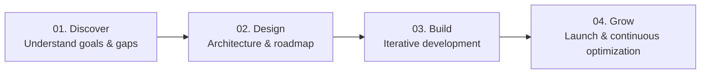

# ⚡ ProvixTech

**Systems & Growth, Under One Roof**

  A technology & growth studio based in Kathmandu, Nepal. We build custom ERP systems and accelerate business growth through Meta advertising, high-performance web development, and digital marketing.

---

## 📌 About ProvixTech

ProvixTech operates as **a partner, not a vendor**. We bridge the gap between engineering robust back-office business systems and delivering customer-facing growth. Instead of juggling disparate agencies and software providers, businesses partner with ProvixTech for complete, end-to-end execution.

* 🇳🇵 **Built for Nepal’s Market** — Deep understanding of local platforms, consumer behavior, and payment ecosystems.
* 🧩 **Full-Stack Execution** — Engineering, design, and performance marketing working in sync.
* 💎 **Transparent Scopes** — Honest numbers and clear milestones with zero hidden fees.
* ⚡ **Fast Turnaround** — Agile delivery without cutting corners.

---

## 🛠️ What We Do

### 1. 🏢 Custom ERP Systems
> *Custom business systems built to fit how your business actually runs.*
- **Unified Operations**: Centralize inventory, sales, billing, staff, and analytics into a single dashboard.
- **Tailored Workflows**: Built specifically for your operational model rather than forcing rigid off-the-shelf software.
- **Reporting & Intelligence**: Real-time insights to drive informed business decisions.

### 2. 🎯 Facebook & Instagram Boosting (Meta Ads)
> *Targeted campaigns engineered to reach real buyers and generate ROI.*
- **Localized Audience Targeting**: Laser-targeted campaigns tailored to demographics and behaviors in Nepal.
- **End-to-End Campaign Management**: Creative direction, copywriting, A/B testing, and budget optimization.
- **Performance-Driven**: Continuous conversion tracking to maximize return on ad spend.

### 3. 🌐 Web Development
> *Fast, responsive, and conversion-optimized websites and web applications.*
- **Modern Web Apps**: Scalable full-stack web applications built with modern frameworks.
- **High-Converting Landing Pages**: Sleek, mobile-first designs optimized for speed and engagement.
- **SEO & Performance Ready**: Fast load times, clean architecture, and best-in-class user experience.

### 4. 📈 Digital Marketing & Strategy
> *Sustainable growth strategies that compound over time.*
- **Search Engine Optimization (SEO)**: Rank higher on search engines and attract organic buyer traffic.
- **Content & Brand Strategy**: Consistent messaging across digital channels to build authority and trust.
- **Retention & Retargeting**: Nurture leads and build repeat customers.

---

## 🔄 How We Work

1. **Discover** — We deep-dive into your business operations, market positioning, and revenue goals.
2. **Design** — We map architecture, UI/UX, and growth funnels before writing a single line of code.
3. **Build** — We build, test, and refine collaboratively with transparent progress check-ins.
4. **Grow** — We deploy, onboard your team, provide technical documentation, and continuously optimize for growth.

---

## 🧰 Technology & Capabilities

| Area | Technologies & Tools |
| :--- | :--- |
| **Frontend & Web** | Next.js, React, TypeScript, Tailwind CSS, HTML5/CSS3 |
| **Backend & Databases** | Node.js, Python, PostgreSQL, REST & GraphQL APIs |
| **Enterprise & ERP** | Custom ERP Architecture, Inventory & Accounting Modules, Role-Based Access Control |
| **Growth & Advertising** | Meta Ads Manager (Facebook/Instagram), Google Analytics, Pixel Tracking, SEO |

---

## 📬 Let's Build Something Great

Looking to streamline your business operations or accelerate customer acquisition?

- 🌐 **Live Website**: [provix-tech.vercel.app](https://provix-tech.vercel.app/)
- 📧 **Email**: [provixtechnology@gmail.com](mailto:provixtechnology@gmail.com)
- 📞 **Phone / WhatsApp**: [+977 986-3197849](tel:+9779863197849)
- 📍 **Headquarters**: Kathmandu, Nepal
- 📱 **Socials**: [Facebook](https://www.facebook.com/profile.php?id=61585222437080) • [TikTok](https://www.tiktok.com/@provixtechnology.com?_r=1&_t=ZS-97vKmlGkY3Z)

---

  © 2026 ProvixTech. All rights reserved.

